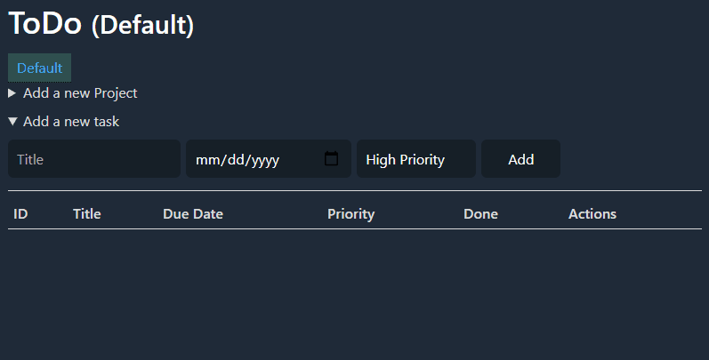

# TODO

### In browser TODO list.

**Note:** Only large screens (1024px to up).
**Note:** No storage is used.

## Built With

-   HTML5
-   CSS3
-   Javascript

## Live Demo

[Check it out here](https://aldemeery.github.io/js-todo/)

## Demo



## Getting Started

In order to start this project, you will need:

```bash
$ git clone https://github.com/aldemeery/js-todo.git
$ cd js-todo
```

and then open the `index.html` file.

## Deployed on GitHub Pages

Deployed on [GitHub Pages](https://pages.github.com/)

## Authors

👤 **Osama Aldemeery**

-   Github: [@aldemeery](https://github.com/aldemeery)
-   LinkedIn: [Osama Aldemeery](https://linkedin.com/in/osamaaldemeery)

## 🤝 Contributing

Contributions, issues, and feature requests are welcome!

## 📝 License

This project is [MIT](LICENSE) licensed.
